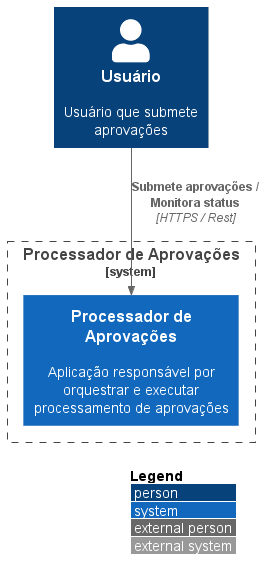

# Processador Assíncrono

Este repositório implementa uma aplicação .NET 8 baseada em **Clean Architecture**, com foco em **processamento assíncrono em lote** utilizando `BackgroundService` e `Channel<Guid>`, com persistência no **SQL Server** via **Dapper**.

---

### Badges


[](https://dotnet.microsoft.com/)
[](https://github.com/DapperLib/Dapper)
[](https://www.microsoft.com/sql-server)
[](https://learn.microsoft.com/dotnet/core/extensions/background-services)
[](https://learn.microsoft.com/dotnet/standard/parallel-programming/channels)
[](https://learn.microsoft.com/aspnet/core/fundamentals/minimal-apis)
[](https://xunit.net/)
[](https://github.com/moq)
[](https://shouldly.readthedocs.io/en/latest/)

[](./LICENSE)

---

## Estrutura do Projeto

```markdown
ProcessadorAssincrono/
├── ProcessadorAssincrono.API → Minimal APIs e configuração
├── ProcessadorAssincrono.Application → Interfaces e contratos
├── ProcessadorAssincrono.Domain → Entidades de negócio
├── ProcessadorAssincrono.Infrastructure→ Implementações (Dapper, BackgroundService)
├── ProcessadorAssincrono.Tests → Testes unitários com xUnit, Shoudly e Moq
```

---

## Tecnologias Utilizadas

- .NET 8
- Dapper
- SQL Server
- BackgroundService
- `Channel<Guid>`
- Minimal APIs
- Polly

---

## Componentes Principais

### `BackgroundService` com `Channel<Guid>`

Permite enfileirar IDs de requisições para processamento em segundo plano, desacoplando a chamada HTTP da lógica de negócio.

### `AprovacaoService` com Dapper

Realiza a atualização da entidade `Aprovacao` no banco SQL Server, marcando como aprovada.

### Minimal API

Expõe o endpoint `api/solicitacoes/{'guid'}/aprovar` para enfileirar múltiplas requisições.

---

## Arquitetura

### Contexto



## Criação e configuração do SQL Server 20222

### Crie um banco de dados via Docker

```bash
docker run -e "ACCEPT_EULA=Y" -e "SA_PASSWORD=SenhaForte123!" \
-p 1433:1433 --name sqlserverdocker \
-v sqlvolume:/var/opt/mssql \
-d mcr.microsoft.com/mssql/server:2022-latest
```

SA_PASSWORD: Defina uma senha forte para o usuário sa. (Pode utilizar o SenhaForte123! que é um padrão)
-p 1433:1433: Expõe a porta padrão do SQL Server.

### Abra com o SQL Server Management Studio e crie o banco `Processador`

```sql
CREATE DATABASE Processador;
```

### Crie a tabela Aprovacoes

```sql
CREATE TABLE Aprovacoes (
    Id UNIQUEIDENTIFIER NOT NULL PRIMARY KEY,
    Pep NVARCHAR(100) NOT NULL,
    ComentariosAdicionais NVARCHAR(MAX) NULL,
    DataAprovacao DATETIME2 NOT NULL
);
```

### Licença

Este projeto está licenciado sob a Licença [MIT](./LICENSE)
