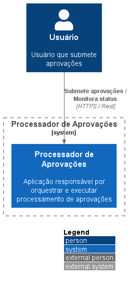

# Processador Assíncrono

Este repositório implementa uma aplicação .NET 10 baseada em **Clean Architecture**, com foco em **processamento assíncrono em lote** utilizando `BackgroundService` e `Channel<Aprovacao>`, com persistência no **SQL Server** via **Dapper**.

---

### Badges


[](https://dotnet.microsoft.com/)
[](https://github.com/DapperLib/Dapper)
[](https://www.microsoft.com/sql-server)
[](https://learn.microsoft.com/dotnet/core/extensions/background-services)
[](https://learn.microsoft.com/dotnet/standard/parallel-programming/channels)
[](https://learn.microsoft.com/aspnet/core/fundamentals/minimal-apis)
[](https://xunit.net/)
[](https://github.com/moq)
[](https://shouldly.readthedocs.io/en/latest/)

[](./LICENSE)

---

## Estrutura do Projeto

```text
ProcessadorAssincrono/
├── ProcessadorAssincrono.slnx
├── global.json                          → SDK 10.0.112
├── docker-compose.yml                   → SQL Server, criação do banco e API
├── docker/init-db.sql                   → banco Processador e tabela Aprovacoes
├── src/ProcessadorAssincrono.API        → Minimal APIs
├── src/ProcessadorAssincrono.Application
├── src/ProcessadorAssincrono.Domain
├── src/ProcessadorAssincrono.Infrastructure
└── tests/ProcessadorAssincrono.Tests    → xUnit, Shouldly e Moq
```

---

## Tecnologias Utilizadas

- .NET 10
- Dapper
- SQL Server
- BackgroundService
- `Channel<Guid>`
- Minimal APIs
- Polly

---

## Componentes Principais

### `BackgroundService` com `Channel<Aprovacao>`

Enfileira solicitações para processamento em segundo plano, desacoplando a chamada HTTP da persistência.

### `AprovacaoService` com Dapper

Realiza a atualização da entidade `Aprovacao` no banco SQL Server, marcando como aprovada.

### Minimal API

| Método | Rota | Efeito |
|---|---|---|
| `PUT` | `/api/solicitacoes/{id}/inserir` | Grava a solicitação no SQL Server |
| `PUT` | `/api/solicitacoes/{id}/aprovar` | Enfileira uma solicitação |
| `POST` | `/aprovar-em-lote` | Enfileira várias solicitações |

---

## Como executar

O `global.json` fixa o SDK **10.0.112** com `rollForward: latestPatch`. Um SDK `10.0.4xx` instalado na máquina não atende esse pin.

### Docker Compose

Sobe o SQL Server, cria o banco `Processador` e a tabela `Aprovacoes`, e inicia a API.

```bash
docker compose up --build -d
```

- API e Swagger: [http://localhost:8080/swagger](http://localhost:8080/swagger)
- SQL Server: `localhost,1433`, usuário `sa`, senha `SenhaForte123!`

```bash
docker compose down
```

O volume `sqlserver-data` preserva o banco entre as execuções. O script `docker/init-db.sql` só cria o banco e a tabela quando eles ainda não existem.

### Na máquina local

Com o SQL Server já acessível em `localhost,1433` (por exemplo, `docker compose up -d sqlserver db-init`):

```powershell
$env:PATH = "$env:LOCALAPPDATA\Microsoft\dotnet;" + $env:PATH
dotnet run --project src/ProcessadorAssincrono.API --launch-profile http
```

Swagger local: [http://localhost:5085/swagger](http://localhost:5085/swagger).

A connection string padrão está em `src/ProcessadorAssincrono.API/appsettings.json`. No Compose, a API usa o host `sqlserver` em vez de `localhost`.

### Testes

```bash
dotnet test ProcessadorAssincrono.slnx
```

## Collection

A collection do Insomnia está em `docs/Files/ProcessadorAssincrono_Insomnia_2025-12-12.yaml`.

## Arquitetura

### Contexto



### Sequência do BackgroundService


## Banco de dados

O Compose aplica `docker/init-db.sql`. O schema resultante é:

```sql
CREATE TABLE Aprovacoes (
    Id UNIQUEIDENTIFIER NOT NULL PRIMARY KEY,
    Projeto NVARCHAR(100) NOT NULL,
    ComentariosAdicionais NVARCHAR(MAX) NULL,
    DataAprovacao DATETIME2 NOT NULL
);
```

### Licença

Este projeto está licenciado sob a Licença [MIT](./LICENSE)
